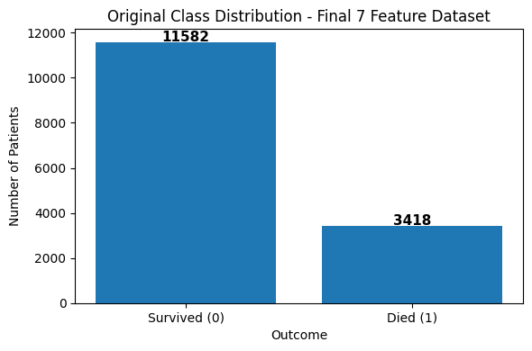
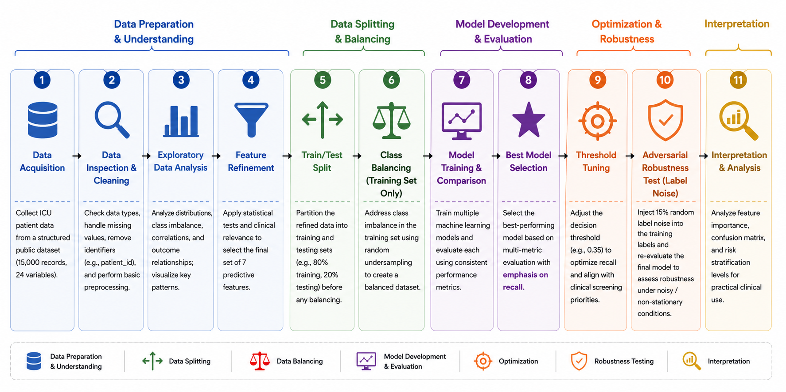

## Visualizations

The project notebook contains additional exploratory and evaluation plots. The figures below present the most significant visualizations used to summarize model performance, interpretability, and data characteristics.

### Class Distribution
Shows the original class imbalance before balancing.

### Methodology Workflow
Illustrates the full machine learning pipeline used in the project.

### ROC Curve
Compares discrimination performance across evaluated models.

### Confusion Matrix
Shows final Tuned XGBoost performance at threshold 0.35.

### Feature Importance
Displays the strongest predictors influencing mortality prediction.

